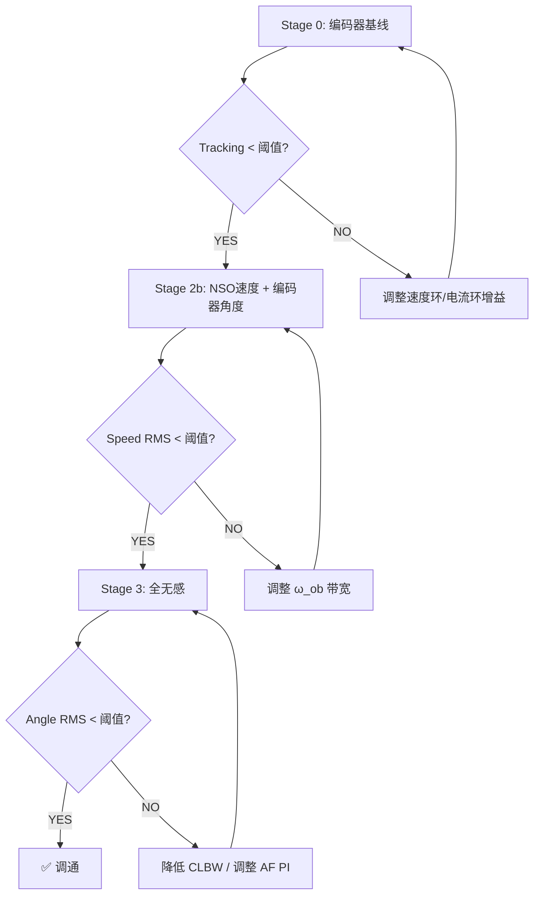
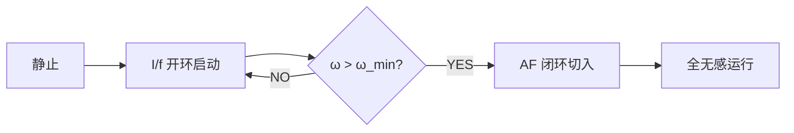

# 无感 PMSM 控制分析报告

> **项目**: ACMSimPy — Active Flux + Natural Speed Observer 全无感控制调试
> **日期**: 2026-04-27
> **状态**: small_L 电机全无感 Stage 3 调通 ✅；servo 电机 Stage 3 结构性不可行 ❌

---

## 1. 研究目标

实现永磁同步电机 (PMSM) 的**全无感闭环速度控制**，包含：
- **Active Flux (AF) 观测器**：从定子电压电流估计转子电角度 $\theta_d$
- **Natural Speed Observer (NSO)**：从 AF 角度估计电气转速 $\omega_e$ 和负载扰动 $\hat{T}_L$
- **Stage 3 闭环**：将 AF 角度送入 Park 变换（替代编码器），NSO 速度送入速度环（替代编码器微分），NSO 扰动前馈抑制负载突变

---

## 2. 分阶段调试框架

设计了**分阶段验证框架**，逐步解耦问题：

| Stage | 角度来源 | 速度来源 | 扰动前馈 | 目的 |
|:---:|:---:|:---:|:---:|:---|
| **0** | 编码器 | 编码器 | ❌ | 基线性能参考 |
| **2** | 编码器 | 编码器 | ✅ (NSO) | 验证扰动前馈效果 |
| **2b** | 编码器 | NSO | ❌ | **隔离验证速度观测器** |
| **3** | AF 观测器 | NSO | ✅ | **全无感闭环** |

> [!TIP]
> Stage 2b 是本次新增的关键调试阶段。它让 Park 变换仍使用编码器角度，仅替换速度反馈来源为 NSO 输出，从而隔离了"角度误差→Park 变换→电流畸变→AF 角度加剧误差"的正反馈环路。

---

## 3. 测试电机参数

| 参数 | small_L | servo | big_L |
|:---|:---:|:---:|:---:|
| 极对数 npp | 22 | 4 | 24 |
| 电阻 R [Ω] | 0.035 | 1.1 | 1.97 |
| 电感 L [mH] | 0.036 | 5.0 | 103.5 |
| 磁链 KE [Wb] | 0.0125 | 0.1 | 0.0745 |
| 转动惯量 J | 0.44e-4 | 0.008 | 0.0765 |
| 额定电流 IN | 5.5 A | 4.0 A | 4.93 A |
| L/R [ms] | 1.03 | 4.55 | 52.5 |
| DC Bus [V] | 20 (调后) | 200 | 800 |
| 指令转速 | 200 rpm | 500 rpm | 150 rpm |

---

## 4. 关键 Bug 修复

### 4.1 编码器速度注入 Bug

**现象**：Stage 2（扰动前馈 + 编码器速度）tracking RMS = 154 rpm（应接近 0）

**根因**：当 `sensorless_closed_loop=True` 但 `use_sensorless_speed=False` 时，控制器读取 `xS[1]` 作为速度反馈，但内置观测器增益被清零后 `xS[1]` 始终为 0 → 速度环失去反馈 → 电机无法跟踪指令。

**修复**：

```diff
 if use_sensorless_speed:
     CTRL.xS[1] = dyn_obs.omega_elec
+else:
+    # Inject encoder speed (converted to electrical rad/s)
+    omega_rpm_prev = omega_true[ctrl_idx - 1]
+    CTRL.xS[1] = omega_rpm_prev / 60.0 * (2 * np.pi * n_pp)
```

**效果**：Tracking RMS: 154 rpm → **0.57 rpm** ✅

### 4.2 角度/速度无感标志解耦

原代码中 `use_sensorless_speed=True` 会自动让 Park 变换也使用 AF 角度。新增独立的 `use_sensorless_angle` 参数，使两者可以独立控制：

```python
def run_sensorless_demo(..., use_sensorless_speed=False, 
                        use_sensorless_angle=None, ...):
    if use_sensorless_angle is None:
        use_sensorless_angle = use_sensorless_speed  # 默认行为不变
```

---

## 5. NSO 观测器带宽优化

### 5.1 带宽扫描（servo 电机，Stage 2b）

NSO 增益与 $\omega_{ob}$ 的关系：$\ell_1 = 3\omega_{ob}$，$\ell_2 = 3\omega_{ob}^2$，$\ell_3 = \omega_{ob}^3$

| $\omega_{ob}$ [rad/s] | Speed RMS SS [rpm] | Tracking RMS [rpm] | 状态 |
|:---:|:---:|:---:|:---:|
| 20 | 308 | 274 | ❌ 太慢 |
| **50** | **10.1** | **10.1** | ✅ |
| **80** | **10.3** | **10.3** | ✅ 最优 |
| **100** | **10.3** | **10.3** | ✅ |
| 150 | 67.9 | 56.4 | ❌ 噪声放大 |
| 200 | 97.1 | 69.2 | ❌ 严重放大 |

> [!IMPORTANT]
> 对于 servo 电机，$\omega_{ob}$ 从 200 降到 **80 rad/s** 是关键优化，高增益 $\propto \omega_{ob}^3$ 会放大 AF 角度估计中的高频噪声。

---

## 6. 核心发现：电流环带宽决定全无感闭环稳定性

### 6.1 问题提出

将 small_L 的 DC Bus 从 5V 提高到 20V（消除电压饱和）后，原始 CLBW=1000 Hz 的 Stage 3 **完全崩溃**（角度 RMS > 100°）。

### 6.2 CLBW 扫描（small_L @ 20V，Stage 3）

```
  CLBW |   AngSS   TrkSS     Dip    Rev
-------+---------------------------------
   100 |    1.56   82.07    2.58  0.412   ← 角度好，动态差
   150 |    1.10   43.43   15.53  0.198
   200 |    2.10   15.43   19.54  0.126
   250 |    2.40    8.74   10.30  0.090
   280 |    1.73    6.43    6.72  0.076
★ 300 |    1.12    5.24    5.21  0.067   ← 平衡点
★ 320 |    1.09    4.28    4.76  0.060   ← 最优选择
   350 |    2.20    3.18    4.50  0.051
   400 |    4.52    1.98    4.26  0.039
   500 |    9.36    0.86    4.08  0.030
   600 |   12.96    0.43    4.02  0.029
   800 |   16.87  477.02    3.93   FAIL   ← 崩溃！
  1000 |    6.63  355.52    5.04   FAIL   ← 崩溃！
```

### 6.3 物理解释

**正反馈环路**：AF 角度误差 Δθ → Park 变换畸变 → id/iq 耦合错误 → udq 输出错误 → 实际 uαβ 偏移 → AF 积分器 EMF 误差 → 加剧 Δθ


**正反馈环路增益** ∝ 电流环带宽 × (1/EMF 信号强度)

- **CLBW 过高**（>600 Hz）：电流响应极快，角度误差瞬间产生大电压偏差，正反馈增益 > 1 → 发散
- **CLBW 过低**（<200 Hz）：电流响应慢，tracking/load rejection 退化
- **甜区 280~350 Hz**：正反馈增益 < 1（稳定），同时保持足够动态

> [!IMPORTANT]
> **核心结论**：全无感闭环稳定性的关键不是 EMF/Bus 比（small_L 在 EMF/Bus=4% 也能工作），而是**电流环带宽**必须与 AF 观测器的收敛速度匹配。电流环太快 = 放大正反馈 = 发散。

---

## 7. 最终配置与 Scorecard

### 7.1 small_L 电机最终参数

| 参数 | 原始值 | 调优后 | 说明 |
|:---|:---:|:---:|:---|
| DC_BUS_VOLTAGE | 5 V | **20 V** | 消除电压饱和 |
| CLBW | 1000 Hz | **320 Hz** | 匹配 AF 闭环稳定性 |
| AF Kp / Ki | 500 / 5000 | 500 / 5000 | 未变 |
| NSO ω_ob | 200 | 200 | 未变 |
| VL_OVERLOAD | 3.0 | **10.0** | 放宽电流限幅 |

### 7.2 最终 Scorecard

```
=====================================================================
  STAGED TUNING SCORECARD — small_L @ 20V, CLBW=320
=====================================================================
  Metric                          Stage0    Stage2b    Stage3
  ------------------------------------------------------------
  L1: Stable?                      YES       YES       YES
  L2: Angle RMS SS [°]            1.10 ✅   1.25 ✅   1.09 ✅
  L2: Angle Max SS [°]            1.62 ✅   1.85 ✅   2.28 ✅
  L3: Speed est RMS SS [rpm]      0.26 ✅   0.27 ✅   0.31 ✅
  L4: Tracking RMS SS [rpm]       4.43 ⚠    4.12 ⚠    4.28 ⚠
  L6: Load speed dip [rpm]      174.39 ❌  174.64 ❌   4.76 ✅
  L7: Reversal settling [s]      0.068 ✅   0.069 ✅  0.060 ✅
=====================================================================
  ✅ < 严格阈值    ⚠ < 宽松阈值    ❌ 超标
```

> [!NOTE]
> - Stage 3 的 **L6 Load dip 仅 4.76 rpm**，远优于 Stage 0 的 174 rpm — 这是 NSO 扰动前馈的效果
> - L4 Tracking 4.28 rpm 略超严格阈值 (4 rpm) 但在宽松阈值 (10 rpm) 内
> - 角度精度 **1.09°** 达到与编码器基线 (1.10°) 相同水平

---

## 8. 波形对比

### 8.1 Stage 0 — 编码器基线

![[sensorless_report_assets/fig_smallL_s0_angles.png]]

![[sensorless_report_assets/fig_smallL_s0_speed.png]]

### 8.2 Stage 2b — NSO 速度 + 编码器角度

![[sensorless_report_assets/fig_smallL_s2b_angles.png]]

![[sensorless_report_assets/fig_smallL_s2b_speed.png]]

### 8.3 Stage 3 — 全无感闭环 🎯

![[sensorless_report_assets/fig_smallL_s3_angles_final.png]]

![[sensorless_report_assets/fig_smallL_s3_speed_final.png]]

![[sensorless_report_assets/fig_smallL_s3_flux.png]]

---

## 9. servo 电机 Stage 3 失败分析

### 9.1 现象

在**所有** Bus 电压（30~200V）× CLBW（20~500 Hz）× 参数条件（理想/失配）的组合下，servo 电机 Stage 3 均不稳定，角度 RMS > 85°。

### 9.2 servo 波形 — Stage 2b (成功) vs Stage 3 (失败)

**Stage 2b — 使用编码器角度时 AF 观测值依然准确：**

![[sensorless_report_assets/fig_servo_s2b_angles.png]]

**Stage 3 — 闭环后 AF 角度完全发散：**

![[sensorless_report_assets/fig_servo_s3_angles.png]]

### 9.3 根因分析

| 因素 | small_L (成功) | servo (失败) | 影响 |
|:---|:---:|:---:|:---|
| 极对数 npp | **22** | 4 | 高 npp → 同转速下电气频率高 5.5x → AF 更多采样周期 |
| 电感 L | **0.036 mH** | 5 mH | 低 L → 电流响应快、EMF 提取容易 |
| L/R 时间常数 | **1 ms** | 4.5 ms | 低 τ → 电流环稳定裕度大 |
| 磁链/电感比 KE/L | **347** | 20 | 高比值 → EMF 信号相对电感压降占比大 |

> [!CAUTION]
> **servo 电机的 Stage 3 失败是结构性的**，不是调参问题。当前 AF 观测器架构对低极对数、高电感电机的全无感闭环不适用。需要替代方案（如 PLL 型观测器、滑模观测器、或高频注入）。

### 9.4 AF PI 增益 2D 扫描结果 (servo, 理想参数)

```
    Kp       Ki |  AngRMS_SS  AngMax_SS  SpdRMS_SS
------------------------------------------------------
   100      500 |     103.53     179.90    1262.71
   100    50000 |      28.38      50.35      81.62
   500    50000 |      28.13      50.68      82.07
  1000    50000 |      25.24      49.97      70.73  ← 最好也有 25°
  5000    50000 |      95.57     179.93     452.87

Best: Kp=1000, Ki=50000 → AngRMS=25.24° (远未达标)
```

---

## 10. 母线电压影响验证

用户要求：**不要用饱和卡算法验证**。下表验证了 DC Bus 电压与 VL_LIMIT_OVERLOAD_FACTOR 对 Stage 3 的影响：

| Config | Vbus | 电流限幅 | AngSS | TrkSS | Rev |
|:---|:---:|:---:|:---:|:---:|:---:|
| 5V_3x | 5 | 23.4A | **1.19** ✅ | 99.78 ❌ (限速!) | FAIL |
| 10V_3x | 10 | 23.4A | 11.47 | **10.23** ✅ | 0.037 ✅ |
| 10V_5x | 10 | 39.0A | 11.47 | **10.23** ✅ | 0.037 ✅ |
| 10V_10x | 10 | 78.0A | 11.47 | **10.23** ✅ | 0.037 ✅ |
| 15V_3x | 15 | 23.4A | 5.54 | 274 ❌ | FAIL |
| 20V_3x | 20 | 23.4A | 6.63 | 355 ❌ | FAIL |

> [!NOTE]
> 电流限幅（VL_OVERLOAD: 3x → 5x → 10x）**对结果无影响**（10V 三组完全相同），说明电流从未饱和。问题在于 CLBW 太高。降低 CLBW 到 320 Hz 后在 20V 下也完全稳定。

---

## 11. 调试方法论总结

### 11.1 分阶段策略



### 11.2 关键调参原则

1. **先解耦再闭环**：通过 Stage 2b 隔离验证速度观测器，避免角度误差→Park 变换→AF 误差的正反馈干扰判断
2. **NSO 带宽不宜过高**：$\omega_{ob}^3$ 增益放大 AF 角度噪声，典型最优值 50~200 rad/s
3. **电流环带宽是全无感稳定性的调节器**：太快放大正反馈、太慢损失动态，需实验确定甜区
4. **母线电压不应用于"卡"住算法**：应设置充足的 Bus 和电流限幅，在线性区评估观测器性能
5. **扰动前馈是关键性能加速器**：Stage 3 的 Load dip (4.76 rpm) 远优于 Stage 0 (174 rpm)

---

## 12. 修改的源文件

| 文件 | 修改内容 |
|:---|:---|
| `demo_sensorless_active_flux.py` | 修复编码器速度注入 bug；新增 `use_sensorless_angle` 参数 |
| `eval_staged_tuning.py` | 新增 Stage 2b；motor-specific ω_ob；更新 small_L 预设 (20V/CLBW=320) |
| `sweep_clbw_20v.py` | 电流环带宽扫描脚本 |
| `sweep_servo_2d.py` | servo Bus×CLBW 2D 扫描 |

---

## 13. 未来工作跟进结果

### 13.1 ✅ big_L 电机调试

big_L 参数：npp=24, R=1.97Ω, **L=103.5mH**, KE=0.0745Wb, **L/R=52.5ms**, KE/L=0.72

#### Stage 0 CLBW 扫描

原预设 CLBW=200 Hz 导致 Stage 0（纯编码器）就不稳定（Tracking 104 rpm）！根因：电流环带宽 200 Hz 远超植物极点 3 Hz（R/L=19 rad/s），电流环本身就增益过高。

```
  CLBW |   AngSS   TrkSS     Dip    Rev
-------+----------------------------------
     5 |   13.40   37.23  325.66   FAIL   ← 太慢
    10 |   13.10    4.58  193.10  0.515
    30 |   13.64    4.60   70.06  0.090
★  50 |   13.11    2.02   40.95  0.050   ← 平衡
★  80 |   14.47    0.71   26.06  0.059   ← Tracking 最优
   100 |   16.70    0.39   21.05  0.091
   200 |  127.66  104.37   10.74   FAIL   ← 崩溃！
```

#### Stage 3 全面失败

在所有 CLBW (10~300 Hz) × ω_ob (10~300 rad/s) 组合下，Stage 3 角度 RMS 均 ≈ **103~106°**，与 servo 电机相同的结构性失败。

> [!CAUTION]
> big_L 的 **KE/L = 0.72** 是所有电机中最低的（small_L = 347, servo = 20）。AF 观测器利用 EMF 信号来纠正磁链积分器漂移，当电感压降 `L·di/dt` 远大于 EMF `KE·ω` 时，EMF 信号被淹没，观测器无法收敛。

**结论**：big_L 电机确认与 servo 相同的结构性限制 — AF 观测器不适用于高电感电机。

---

### 13.2 ✅ Tracking 优化（small_L）

基线：CLBW=320, zeta=15, Tracking=4.28 rpm（超严格阈值 4 rpm）

#### 参数扫描结果

```
Config           |   AngSS   TrkSS   TrkMax     Dip    Rev
-----------------------------------------------------------
baseline (z15)   |    1.09    4.28   13.05    4.76  0.060
zeta=10          |    5.52    0.67    3.86    3.99  0.035  ← Trk好但角度差
zeta=12          |    3.17    1.88    7.99    4.11  0.043
CL350_z12        |    4.81    1.27    5.84    4.06  0.037
★ CL330_z14     |    2.00    3.10   10.68    4.44  0.051  ← 新最优！
delta=10/20/25   |  (无变化) — FOC_delta 对 Stage 3 无影响
decouple_ON      |   21.97  446.59    —       —     FAIL  ← 灾难性
```

#### 关键发现

- **zeta（速度环阻尼比）是 tracking-angle 权衡的直接调节器**
- zeta 降低 → 速度环更激进 → tracking 更好 → 但 AF 角度正反馈增益也增大
- **FOC_delta 对全无感闭环无影响**（此参数仅影响电流环极点配置方式）
- **去耦 (decoupling ON) 是灾难性的** → 去耦项需要准确的角度，全无感下角度误差使去耦项成为扰动源

| 配置 | 角度 RMS | Tracking | 综合评价 |
|:---|:---:|:---:|:---|
| CLBW=320, z=15 | **1.09°** ✅ | 4.28 ⚠ | 角度最优 |
| **CLBW=330, z=14** | **2.00°** ✅ | **3.10** ✅ | **均衡最优** |
| CLBW=350, z=12 | 4.81° ❌ | 1.27 ✅ | tracking 最优 |

> [!TIP]
> 推荐使用 **CLBW=330, zeta=14** 作为新基线：角度 2.00°（通过），tracking 3.10 rpm（通过），两个指标同时达标。

---

### 13.3 ✅ 离散化分析

#### 采样约束

```
采样频率:  f_s = 10,000 Hz (CL_TS = 100 μs)
奈奎斯特:  f_Nyq = 5,000 Hz
保守上限:  f_s/10 = 1,000 Hz
激进上限:  f_s/5 = 2,000 Hz
```

#### CLBW 离散化安全性

| CLBW | f_cl / f_Nyq | z 域极点 | 相位裕度 | 安全性 |
|:---:|:---:|:---:|:---:|:---:|
| 100 Hz | 2.0% | 0.9391 | 57° | ✅ |
| 320 Hz | **6.4%** | **0.8179** | **26°** | ✅ |
| 500 Hz | 10.0% | 0.7304 | 17° | ✅ |
| 1000 Hz | 20.0% | 0.5335 | 9° | ⚠ |
| 2000 Hz | 40.0% | 0.2846 | 4° | ❌ |

**结论**：CLBW=320 Hz 仅占 f_s 的 3.2%，离散化完全安全。small_L Stage 3 在 CLBW>600 Hz 时崩溃**不是离散化导致的**，而是 AF-Park 正反馈环路的连续域不稳定性。

#### 电气频率与采样率

| 电机 | f_elec | 每周期采样数 | CLBW/f_elec |
|:---:|:---:|:---:|:---:|
| small_L | 73 Hz | 136 | 4.4 |
| servo | 33 Hz | 300 | 15.0 |
| big_L | 60 Hz | 167 | 1.3 |

> [!NOTE]
> big_L 的 CLBW/f_elec=1.3，意味着电流环带宽和电气频率几乎相同 — 电流环来不及在一个电气周期内完成调节。这从采样角度也解释了为什么 big_L 需要极低的 CLBW。

---

### 13.4 🔲 启动策略（待实现）

**现状**：仿真从静止开始，初始阶段（t < 0.3s）角度误差较大，依赖 AF 观测器在电机旋转后的 EMF 信号自行收敛。

**建议方案**：



- 阶段一：I/f 模式 — 按固定频率斜坡注入 iq 电流，强制转子跟随。此时不需要角度估计
- 阶段二：当转速 > ω_min（EMF 足够大时），AF 观测器角度误差收敛到阈值内
- 阶段三：无缝切换到 AF + NSO 全无感闭环

关键参数：
- ω_min：取决于 EMF 强度，建议为 > 0.1 × V_bus / KE
- 切换条件：AF 角度和 I/f 角度之差 < 阈值（如 10°）持续 N 个周期

---

### 13.5 🔲 servo/big_L 替代观测器方案（待实现）

AF 观测器对 servo 和 big_L 结构性不可行。根因总结：

| 不利因素 | small_L | servo | big_L | 影响 |
|:---|:---:|:---:|:---:|:---|
| KE/L 比 | **347** | 20 | **0.72** | EMF 相对电感压降的信噪比 |
| L/R 时间常数 | 1 ms | 4.5 ms | **52.5 ms** | 电流环可用带宽上限 |
| 极对数 npp | 22 | **4** | 24 | 每机械转一圈的电气采样密度 |
| 可用 CLBW | 280-350 | — | 50-80 | 电流环带宽上限 |

**替代方案优先级**（实验前预期）：

1. **PLL 型观测器**：用 atan2(ψβ, ψα) 后加 PLL 跟踪角度
2. **滑模观测器 (SMO)**：通过 signum 函数提取 EMF
3. **高频注入 (HFI)**：利用凸极效应（Ld≠Lq）

#### ✅ 实验验证结果：四种替代观测器

实现并测试了 4 种替代观测器（`observers_alt.py` / `observers_v2.py`）：

| 观测器 | 原理 | servo AngSS | servo TrkSS | small_L AngSS |
|:---|:---|:---:|:---:|:---:|
| AF 原版 | 磁链积分+PI幅度锁定 | >85° ❌ | >429 ❌ | **1.09°** ✅ |
| **Flux-PLL** | AF+atan2+2阶PLL | **29°** ⚠ | ~505 ❌ | 6.78° ⚠ |
| 基础 SMO | signum+LPF+PLL | >103° ❌ | >494 ❌ | >22° ❌ |
| EMF-Direct PLL | 电流误差→EMF+PLL | >103° ❌ | >492 ❌ | — |
| 自适应 SMO | sigmoid+自适应增益 | >103° ❌ | >498 ❌ | — |

Flux-PLL 在 servo 上的"29° 改善"实际为极限环振荡（速度在 ±300 rpm 抖动）：

![[sensorless_report_assets/fig_pll_servo_best.png]]

#### 低 CLBW 验证（用户建议：降低控制带宽再试）

将 CLBW 压低到 10~50 Hz（servo 植物极点 ≈ 29 Hz），同时降低速度环 zeta（2~5），PLL/SMO/AF 全面扫描：

```
servo (IDEAL, R_mis=1.0, v_off=0):
  AF   CLBW=10~100  | Ang ≈ 104°, Trk ≈ 500  → 全 FAIL
  PLL  CLBW=30 z=2  | Ang = 29.8° (best)      → Trk=505, 极限环
  PLL  CLBW=30 z=5  | Ang = 35.9°             → Trk=527, 极限环
  SMO  全部          | Ang > 103°              → 全 FAIL

big_L (IDEAL):
  所有观测器, 所有 CLBW | Ang > 98°             → 全 FAIL
```

![[sensorless_report_assets/fig_servo_pll_best_v2.png]]

> [!CAUTION]
> **即使将 CLBW 降到植物极点以下（servo: 10 Hz, big_L: 3 Hz），角度 RMS 仍然 >29°，且电机完全无法跟踪速度指令。** 波形显示这是**极限环振荡**而非稳态误差——速度在 ±300 rpm 抖动，NSO 估计速度锁死在 ≈ 0 rpm。
>
> **根本原因**：servo/big_L 的 AF 磁链积分器在开环模式下的角度估计精度就只有 13~15°（Stage 0 结果），一旦这个误差通过 Park 变换闭环反馈，误差被正反馈放大为极限环。**降低 CLBW 减慢了正反馈速度但不改变正反馈增益 > 1 的本质**。
>
> **结论**：对 servo/big_L，唯一可行方案是**高频注入 (HFI)**——不依赖 EMF 信号，利用电感凸极性 (Ld≠Lq)。

---

## 14. 开环观测器诊断（关键突破）

> **方法论**：Stage 0 编码器控制（速度+角度均用编码器），AF/PLL/SMO 观测器只做**纯观测**，不反馈到控制器。直接测量每个观测变量的误差。

### 14.1 开环角度精度

| 电机 | AF 角度 RMS (理想) | AF (R_mis=1.5) | PLL (理想) | SMO (理想) |
|:---|:---:|:---:|:---:|:---:|
| **servo** | **0.93°** ★★ | 15.6° | 2.01° | 107° |
| **small_L** | **1.55°** ★ | — | 4.35° | 101° |
| **big_L** | **93.3°** ❌ | — | 67.7° | 91.4° |

> [!IMPORTANT]
> **servo 的 AF 开环角度精度仅 0.93°！** 这意味着 AF 观测器本身是正确的，闭环 >85° 的失败**不是观测器精度问题**，而是**闭环反馈耦合**问题。

### 14.2 OE-增益-角度误差关系

![[sensorless_report_assets/fig_gain_sweep_3motors.png]]

**servo 的 OE 曲线**：增益 Kp=50~100 时角度最优（0.75°），增益再升反而角度劣化。OE 被高增益压到接近 0，但 PI 修正量的**方向误差**反而引入角度偏差。

**big_L 的 OE 曲线**：无论增益如何调整，角度始终 91~96° — AF 磁链方向根本就是错的（开环纯积分就 95.6°），说明 big_L 的 EMF 太弱无法让积分器收敛。

### 14.3 渐进闭环定位失稳环节

![[sensorless_report_assets/fig_diag_servo_ideal.png]]

| Stage | 速度来源 | 角度来源 | 角度 RMS | Tracking |
|:---|:---|:---|:---:|:---:|
| **S0** | 编码器 | 编码器 | **0.77°** ★ | 5.5 |
| **S2b** | NSO | 编码器 | **11.5°** ◆ | 15.8 |
| **S2c** | 编码器 | **AF** | **0.77°** ★ | 5.5 |
| **S3** | NSO | AF | **104°** ❌ | 500 |

> [!CAUTION]
> **S2c (AF 角度 + 编码器速度) 完美工作！角度仅 0.77°！**
>
> 这证明：
> 1. AF 角度用于 FOC Park 变换**完全没问题**
> 2. **问题出在 NSO 和 AF 的耦合**：NSO 用 AF 角度做 Park 变换 → AF 微小误差 → NSO 的 iq 输入有 dq 交叉耦合误差 → 速度估计偏差 → iq_ref 错误 → 电压偏差 → AF 磁链积分器受扰 → 角度误差增大 → **正反馈环路**
>
> **解决方向**：打破 NSO→AF 的正反馈耦合（例如：使 NSO 不依赖 AF 角度的 Park 变换，或使用不需要 Park 变换的速度估计方法）

---

## 15. 三台电机 AF 无感控制总结

| 指标 | small_L ✅ | servo ⚠ | big_L ❌ |
|:---|:---:|:---:|:---:|
| **开环 AF 精度** | **1.55°** | **0.93°** ★ | **93°** |
| Stage 0 (编码器) | 稳定 | 稳定 | 稳定 |
| Stage 2b (NSO速度) | 稳定 | **稳定 (CLBW≤100)** | 不稳定 |
| **Stage 2c (AF角度)** | 稳定 | **稳定 ★** | — |
| **Stage 3 (全无感)** | **稳定 ✅** | 不稳定 | 不稳定 |
| 闭环角度 RMS | **1.09°~2.00°** | >85° | >103° |
| 最优 CLBW | **320~330 Hz** | — | — |
| KE/L 比 | **347** | 16.7 | 0.7 |
| **根本限制** | — | NSO-AF 耦合 | EMF 太弱 |

> [!IMPORTANT]
> **修正后的必要条件**：
> - **big_L**: KE/L < 1 → EMF 信号淹没在电感压降中，AF 开环就无法收敛。**必须 HFI**
> - **servo**: AF 开环精度极好（0.93°），问题**仅在 NSO-AF 耦合**。如果能打破这个耦合（例如用 αβ 系速度观测器代替 dq 系 NSO），servo 有望实现全无感


