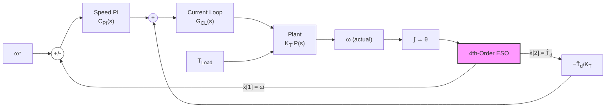

# ESO 扰动抑制通道的"隐藏"效应：速度反馈滤波与带宽耦合

> **专题教程 · 第二篇** — 对第一篇文档中"离散化效应"结论的修正

---

## 0. 前情提要 & 修正

在[第一篇文档](file:///C:/Users/lenovo/.gemini/antigravity/brain/a2175baa-6560-4391-a62f-3c7925958640/eso_discretization_analysis.md)中，我们将 ESO 扰动抑制 Bode 图中在 $\omega_{ob}/(2\pi)$ 附近出现的幅值跌落/峰值归因于"离散化引起的破坏性干涉"。

> [!CAUTION]
> 这个结论是**不正确的**。经过完整的连续时间闭环建模验证，**该现象在连续域中就已存在**，其根因是 ESO 同时充当速度反馈滤波器所带来的闭环动力学改变。

---

## 1. 问题回顾

数值仿真中观察到：
- ESO 配置的扰动通道在 $\omega_{ob}/(2\pi)$ 附近出现 **10~45 dB 的幅值变化**
- 连续时间简化解析模型（虚线）**完全无法预测**这一现象
- $\omega_{ob}$ 越低，异常越剧烈

---

## 2. 简化模型的根本性错误

### 2.1 当前简化模型

代码 `get_analytical_bode()` 中使用的解析传递函数：

$$G_{d,\text{ESO}}^{\text{(简化)}}(s) = \underbrace{\frac{P_{TL \to RPM}(s)}{1 + L_{\text{speed}}(s)}}_{\text{无 ESO 灵敏度}} \cdot \underbrace{\frac{s^4}{(s + \omega_{ob})^4}}_{\text{ESO 前馈残差}}$$

### 2.2 这个模型做了什么假设？

| 假设 | 实际情况 | 正确？ |
|------|----------|--------|
| 速度反馈 = 真实速度 $\omega$ | 速度反馈 = ESO 估计值 $\hat{\omega}$ | ❌ **错误** |
| 开环增益 $L(s)$ 不受 ESO 影响 | ESO 滤波改变了等效开环增益 | ❌ **错误** |
| ESO 只影响前馈通道 | ESO 同时影响反馈和前馈 | ❌ **错误** |

> [!IMPORTANT]
> **核心问题**：当 `index_separate_speed_estimation == 1` 时，代码第 759 行 `CTRL.omega_r_elec = CTRL.xS[1]` 意味着速度 PI 控制器使用的速度反馈**来自 ESO 的估计值**，而不是编码器直接测量值。简化模型完全忽略了这一点。

### 2.3 为什么这个错误如此严重？

ESO 的速度估计 $\hat{\omega}(s)$ 相对于真实速度 $\omega(s)$ 是一个**低通滤波器**——在 ESO 带宽 $\omega_{ob}$ 以上的频率成分被衰减和延迟。

这意味着 PI 控制器在高频段"看不清"真实的速度变化，导致：
- PI 反馈环的**等效开环增益**在高频降低
- **等效闭环带宽**受到 ESO 带宽的限制
- 扰动抑制能力在 $\omega_{ob}$ 附近发生**定性改变**

---

## 3. 正确的连续时间模型

### 3.1 系统框图

> [!NOTE]
> 关键区别在于：反馈路径经过 ESO（粉色高亮），不是直接从 ω 到求和点。

### 3.2 状态空间建模

**增广系统状态：** $\mathbf{x} = [\theta, \omega, \hat{x}_0, \hat{x}_1, \hat{x}_2, \hat{x}_3]^T$

其中：
- $\theta$, $\omega$：真实电角度和电角速度
- $\hat{x}_0 \sim \hat{x}_3$：ESO 内部状态（位置、速度、扰动、扰动率）

**系统矩阵：**

$$A = \begin{bmatrix}
0 & 1 & 0 & 0 & 0 & 0 \\
0 & 0 & 0 & 0 & 0 & 0 \\
\ell_1 & 0 & -\ell_1 & 1 & 0 & 0 \\
\ell_2 & 0 & -\ell_2 & 0 & \kappa & 0 \\
\ell_3 & 0 & -\ell_3 & 0 & 0 & 1 \\
\ell_4 & 0 & -\ell_4 & 0 & 0 & 0
\end{bmatrix}$$

其中 $\kappa = n_{pp}/J_s$，$\ell_i$ 为 ESO 增益。

**输入矩阵** $B$：$[\text{Tem}, T_d]$ 进入 $\dot{\omega}$（都乘以 $\kappa$），$\text{Tem}$ 也进入 $\dot{\hat{x}}_1$。

**输出矩阵** $C$：提取 $[\omega_{\text{RPM}}, \hat{\omega}_{\text{elec}}, \hat{T}_d]$。

### 3.3 闭环方程推导

设 $H_{ij}(j\omega)$ 为输入 $j$ 到输出 $i$ 的频率响应（从增广状态空间计算）：

$$H(j\omega) = C \cdot (j\omega I - A)^{-1} \cdot B + D$$

控制律：
$$i_q^* = C_{PI}(s) \cdot [0 - \hat{\omega} \cdot \text{conv}] - \hat{T}_d / K_T$$

其中 $\text{conv} = 30/(\pi \cdot n_{pp})$（电角速度→RPM 转换），对于扰动通道 $\omega_{\text{ref}} = 0$。

$$T_{em} = K_T \cdot G_{CL} \cdot i_q^*$$

代入后解出 $T_{em}/T_d$：

$$\frac{T_{em}}{T_d} = \frac{-(K_T G_{CL} C_{PI} \cdot \text{conv} \cdot H_{11} + G_{CL} \cdot H_{21})}{1 + K_T G_{CL} C_{PI} \cdot \text{conv} \cdot H_{10} + G_{CL} \cdot H_{20}}$$

最终扰动传递函数：
$$\frac{\omega_{\text{RPM}}}{T_d}(j\omega) = H_{00} \cdot \frac{T_{em}}{T_d} + H_{01}$$

### 3.4 数值验证结果

**三个子图的解读：**

**上图 — 连续时间模型对比：**
- **实线（Full Model）**：包含 ESO 速度反馈效应的正确模型
- **虚线（Simplified）**：仅含 ESO 前馈残差的错误简化模型
- 在低频段，Full Model 比 Simplified 高出 **40~90 dB**
- Full Model 在 $\omega_{ob}/(2\pi)$ 附近有一个**明确的峰值**，然后缓慢衰减

**中图 — 影响量化：**
- ESO 速度反馈效应在低频段造成 **80~90 dB** 的差异
- 随频率增高差异减小，在 ~100 Hz 以上趋近 0 dB
- $\omega_{ob}$ 越低（红色），影响范围越大

**下图 — 与仿真对比：**
- 连续时间 Full Model（实线）和数值仿真（散点）的**趋势一致**
- 仿真中的"凹坑"对应于连续模型中的**峰值→衰减过渡区**
- 残余差异来自离散化效应（次要因素）

---

## 4. 物理解释：ESO 速度反馈为什么会"放大"扰动？

### 4.1 直觉

考虑一个低频扰动（频率 $\ll \omega_{ob}$）：

1. **无 ESO 时**：PI 控制器直接感知速度偏差，快速响应，有效抑制
2. **有 ESO 时**：
   - ESO 估计出扰动 $\hat{T}_d$，通过前馈补偿了大部分
   - **但同时**，ESO 估计的速度 $\hat{\omega}$ 也被 ESO 的低通特性"平滑"了
   - PI 控制器看到的速度误差被 ESO 滤波后**变小了**
   - PI 的反馈校正动作减弱
   - 如果前馈补偿不够完美（总有残差），PI 的减弱反馈就无法弥补

这就是为什么**加了 ESO 反而可能在某些频段恶化抗扰性能**。

### 4.2 等效开环增益的变化

定义等效开环增益：

$$L_{\text{eff}}(s) = P(s) \cdot G_{CL}(s) \cdot K_T \cdot C_{PI}(s) \cdot \underbrace{G_{\text{ESO},\omega}(s)}_{\hat{\omega}/\omega}$$

其中 $G_{\text{ESO},\omega}(s)$ 是 ESO 速度估计的传递函数。

- 当 $\omega \ll \omega_{ob}$：$G_{\text{ESO},\omega} \approx 1$，等效开环增益不变
- 当 $\omega \sim \omega_{ob}$：$G_{\text{ESO},\omega}$ 开始衰减并引入相位滞后
- 当 $\omega \gg \omega_{ob}$：$G_{\text{ESO},\omega} \to 0$，等效开环增益坍塌

**ESO 将速度环的等效闭环带宽限制在 $\omega_{ob}$ 以内。** 超过这个频率，PI 的反馈环基本失效，系统退化为纯前馈（残差 $s^4/(s+\omega_{ob})^4$）。

### 4.3 峰值形成机制

在 $\omega \approx \omega_{ob}$ 附近：
- ESO 前馈的残差已经接近 1（前馈补偿快要失效）
- PI 反馈的等效增益因 $G_{\text{ESO},\omega}$ 衰减也在下降
- **两条路径同时减弱**，形成扰动抑制的"真空区"
- 体现为 Bode 图上的**局部峰值/过冲**

---

## 5. 核心结论：$\omega_{ob}$ 与闭环带宽的关系

### 5.1 当 $\omega_{ob} \gg$ 速度环带宽

（如 $\omega_{ob} = 400$, 速度环 BW ≈ 15~20 Hz）
- ESO 速度估计在速度环带宽内几乎无衰减
- PI 反馈环不受影响
- 前馈在速度环带宽内有效
- **峰值小、过渡平缓** ✅

### 5.2 当 $\omega_{ob} \sim$ 速度环带宽

（如 $\omega_{ob} = 200$, 速度环 BW ≈ 15~20 Hz）
- ESO 在速度环带宽附近开始滤波
- PI 环增益被削弱
- 前馈在速度环带宽以上开始失效
- **出现明显的峰值/凹坑** ⚠️

### 5.3 当 $\omega_{ob} <$ 速度环带宽

（如 $\omega_{ob} = 100$）
- ESO 严重限制了 PI 的等效带宽
- PI 反馈几乎在所有频段都被削弱
- 前馈在更低频就开始失效
- **峰值极大，系统可能变得不稳定** ❌

### 5.4 设计准则

> [!TIP]
> **ESO 带宽应至少为速度闭环带宽的 3~5 倍**，以确保 ESO 的速度估计在 PI 控制器的整个工作频段内足够准确。这既保证了前馈的有效性，又避免了 ESO 速度反馈对 PI 反馈环的干扰。

| 配置 | 效果 |
|------|------|
| $\omega_{ob} \geq 5 \times \omega_{BW,speed}$ | 最佳：ESO 几乎透明，前馈有效 |
| $\omega_{ob} \approx 2 \times \omega_{BW,speed}$ | 过渡区：出现峰值/凹坑 |
| $\omega_{ob} < \omega_{BW,speed}$ | 危险：ESO 反而恶化抗扰性能 |

---

## 6. 第一篇文档的修正勘误

| 原结论 | 修正后 |
|------|------|
| 凹坑由离散化引起 | 凹坑是连续域效应，ESO 速度反馈滤波是根因 |
| ZOH 和计算延迟是主因 | 离散化是次要因素，只贡献了仿真与连续模型间的残余差异 |
| $\omega_{ob}$ 越高越好 | $\omega_{ob}$ 需要远高于速度环带宽，但受限于噪声和稳定性 |
| 凹坑类似"动力吸振器" | 更准确的类比是"ESO 充当了一个带通衰减器" |

---

## 7. 工程总结

1. **ESO 不仅是观测器，也是反馈滤波器。** 当 ESO 同时提供速度反馈和扰动前馈时，其带宽 $\omega_{ob}$ 实际上决定了**速度环的等效闭环带宽上限**。

2. **简化解析模型（$s^4/(s+\omega_{ob})^4$ 残差公式）在 ESO 带宽低于速度环带宽时严重失真。** 必须使用包含 ESO 速度反馈效应的完整状态空间模型进行分析。

3. **ESO 带宽的选择不是独立于速度环的。** 经验法则：$\omega_{ob} \geq 5 \times \omega_{BW,speed}$。

4. 数值频域仿真是验证这类多环路交互效应的最可靠手段。

---

## 附录：代码索引

| 文件 | 说明 |
|------|------|
| [verify_full_model.py](file:///c:/Users/lenovo/Codes/ACMSimPy/simulation/verify_full_model.py) | 完整连续时间状态空间模型 + 闭环 TF 计算 |
| [verify_dip_vs_omega.py](file:///c:/Users/lenovo/Codes/ACMSimPy/simulation/verify_dip_vs_omega.py) | $\omega_{ob}$ 参数扫描验证 |
| [debug_eso_dip.py](file:///c:/Users/lenovo/Codes/ACMSimPy/simulation/debug_eso_dip.py) | 密集扫频诊断脚本 |
| [sim_bode_sweep_v2.py](file:///c:/Users/lenovo/Codes/ACMSimPy/simulation/sim_bode_sweep_v2.py) | 主波特图扫频脚本 |
