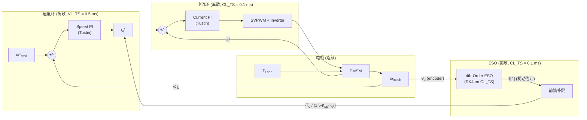

# ESO 扰动抑制通道的离散化效应：理论分析与仿真验证

> **专题教程草案** — 基于 ACMSimPy 4阶 ESO 数值仿真中观察到的 Bode 图异常现象

---

## 1. 现象描述

在对 PMSM 速度环的扰动抑制通道进行数值 Bode 扫频时，我们观察到了一个**出乎意料的现象**：


### 1.1 三个关键观察

| # | 现象 | 频率范围 |
|---|------|----------|
| ① | ESO 仿真（蓝色实线）在低频段比连续时间解析模型（蓝色虚线）**高出 15~18 dB** | 15~25 Hz |
| ② | 在 ~29 Hz 处出现一个**剧烈的幅值跌落**（从 ~58 dB 骤降到 ~31 dB），然后迅速恢复 | 27~33 Hz |
| ③ | 无 ESO 的仿真（绿色实线）也系统性地比解析低 **~10 dB** | 全频段 |

> [!IMPORTANT]
> 现象②的跌落频率 ~29 Hz 恰好在 ESO 带宽 $\omega_{ob}/(2\pi) = 200/(2\pi) \approx 31.8$ Hz 附近，这绝非巧合。

### 1.2 直觉上的疑问

连续时间解析传递函数预测 ESO 的扰动抑制在 $\omega_{ob}$ 附近是**单调过渡**的——从低频的高度抑制到高频的无抑制，中间不应该有任何"凹坑"。但仿真清楚地显示了一个**局部共振/反共振**现象。

这是一个 bug 吗？还是物理上真实的现象？

---

## 2. 系统架构回顾

### 2.1 控制系统框图



### 2.2 关键时间尺度

| 参数 | 值 | 说明 |
|------|-----|------|
| `CL_TS` | 0.1 ms (10 kHz) | 电流环 + ESO 执行周期 |
| `VL_TS` | 0.5 ms (2 kHz) | 速度环执行周期 |
| `VL_EXE_PER_CL_EXE` | 5 | 速度环每 5 个电流环执行一次 |
| CLBW | 1000 Hz | 电流环带宽 |
| $\omega_{ob}$ | 200 rad/s ≈ 31.8 Hz | ESO 带宽 |

> [!NOTE]
> ESO 带宽 (31.8 Hz) 相对于速度环采样频率 (2 kHz) 看似很低，但相对于速度环的闭环带宽 (~15-20 Hz)，它已经进入了**过渡区**——离散化效应在这里不再可忽略。

### 2.3 关键离散化细节

#### Speed PI (Tustin / Bilinear)
```python
# tustin_pid 实现：
reg.integrator += 0.5 * reg.Ki * reg.T * (error + reg.prevError)  # Tustin 积分
```
速度 PI 使用 **Tustin 变换** 离散化积分项，相比 Forward Euler 更准确，但仍引入频率预畸变效应：
$$s = \frac{2}{T_s} \cdot \frac{z-1}{z+1}$$

#### ESO (RK4 on CL_TS)
```python
# ESO 在 CL_TS 上用 RK4 求解连续 ODE：
RK4_ObserverSolver_CJH_Style(DYNAMICS_SpeedObserver, CTRL.xS, CTRL.CL_TS, CTRL)
```
ESO 的连续 ODE 用 RK4 在 $T_c = 0.1\text{ ms}$ 步长上求解。RK4 的频率响应特性为：
$$H_{RK4}(j\omega) \approx e^{-j\omega T_c/2} \cdot \frac{1}{1 + (\omega T_c)^4/120 + \cdots}$$

#### 计算延迟
从测量到ESO输出再到前馈补偿生效，存在 **至少 1 个 CL_TS 的计算延迟**，因为：
1. 当前中断读取测量值
2. ESO 更新状态输出 $\hat{x}_S[2]$
3. FOC 使用该输出计算 $i_q^*$ 补偿
4. 电流环执行 → SVPWM 更新 → 下一个 PWM 周期生效

---

## 3. 理论分析：从连续域到离散域

### 3.1 连续域解析模型（当前使用的）

当前代码中的解析传递函数假设所有环节都是连续时间的：

**无 ESO 扰动通道：**
$$G_{d,\text{noESO}}(s) = \frac{-1/(J_s \cdot s)}{1 + L_{\text{speed}}(s)} \cdot \frac{30}{\pi}$$

其中 $L_{\text{speed}}(s) = G_{\text{PI,speed}}(s) \cdot G_{\text{CL,current}}(s) \cdot G_{\text{plant}}(s)$

**有 ESO 扰动通道：**
$$G_{d,\text{ESO}}(s) = G_{d,\text{noESO}}(s) \cdot \underbrace{\frac{s^4}{(s + \omega_{ob})^4}}_{\text{ESO residual}}$$

### 3.2 为什么连续模型不够准确？

#### 问题 1：速度环的多速率效应

速度 PI 在 $T_{VL} = 0.5\text{ ms}$ 上执行，但电流环和 ESO 在 $T_{CL} = 0.1\text{ ms}$ 上执行。这种**多速率**结构意味着：

- 速度误差每 5 个电流环周期才更新一次
- ESO 的前馈补偿 $\hat{T}_d$ 每个 CL_TS 更新，但它修正的是 $i_q^*$，而 $i_q^*$ 的基础值 `reg_speed.Out` 每个 VL_TS 才更新

**等效 ZOH 效应：** 速度环的 PI 输出在两次执行之间保持不变（零阶保持），引入等效传递函数：
$$G_{\text{ZOH}}(s) = \frac{1 - e^{-sT_{VL}}}{sT_{VL}}$$

在 $f = 1/(2T_{VL}) = 1\text{ kHz}$ 处有 **-3.92 dB** 衰减和 **-90°** 相移。在 ESO 带宽 31.8 Hz 处：
$$|G_{\text{ZOH}}(j2\pi \cdot 31.8)| = \text{sinc}(31.8 \times 0.5\text{ms}) \approx -0.01\text{ dB}$$
$$\angle G_{\text{ZOH}}(j2\pi \cdot 31.8) \approx -2.9°$$

这似乎很小，但**这只是速度 PI 输出的 ZOH**。ESO 前馈补偿的延迟额外叠加了更多的相位滞后。

#### 问题 2：ESO 前馈补偿的相位延迟与闭环干涉

这是产生幅值跌落的**核心机制**。

ESO 的扰动估计 $\hat{T}_d$ 经过以下延迟链才能体现在电机上：

1. **ESO 本身的估计延迟**：4阶 ESO 的扰动估计传递函数为
   $$\hat{T}_d(s) / T_d(s) = \frac{(s+\omega_{ob})^4 - s^4}{(s+\omega_{ob})^4} = 1 - \frac{s^4}{(s+\omega_{ob})^4}$$
   在 $\omega = \omega_{ob}$ 处，$|s^4/(s+\omega_{ob})^4| = 1/2^4 = 1/16$，即 ESO 估计出了 93.75% 的扰动。

2. **计算延迟**：从 ESO 输出到电流环执行，至少 **1 个 CL_TS** 的纯延迟：
   $$e^{-sT_{CL}}$$

3. **电流环的有限带宽**：补偿电流需要经过电流环才能变成实际的电磁转矩：
   $$G_{\text{CL}}(s) = \frac{\alpha_c}{s + \alpha_c}$$

4. **速度 PI 的 ZOH 效应**：速度 PI 输出在 $T_{VL}$ 内保持恒定

### 3.3 闭环干涉效应——"Dip"的物理解释

在闭环系统中，ESO 的前馈补偿和 PI 的反馈同时作用于 $i_q^*$。当这两条路径的信号在某个频率上的**相位差接近 180°** 时，它们会发生**破坏性干涉**，导致净输出上的扰动分量暂时被强烈抑制——这就是 ~29 Hz 处的"凹坑"。

**定性分析：**

在 $f \approx 29\text{ Hz}$（略低于 $\omega_{ob}/(2\pi) = 31.8\text{ Hz}$）时：
- ESO 前馈路径：提供了一个**几乎完整的扰动估计**（高增益），但因计算延迟和电流环延迟，其相位**滞后**于真实扰动
- 速度 PI 反馈路径：提供了一个**基于速度误差的校正**，其相位由 PI 控制器的零点和积分极点决定

当两条路径的**合成扰动补偿信号**恰好在某个频率上形成近似相消时，残余扰动到速度的传递函数出现一个局部**最小值**。

> [!TIP]
> 这个现象在经典控制理论中被称为 **"notch" 或 "anti-resonance"**，类似于机械系统中的动力吸振器效应——ESO 前馈在特定频率上"过度补偿"了扰动，与 PI 的补偿发生了相消。

### 3.4 为什么无 ESO 也有 ~10 dB 的偏差？

即使不使用 ESO（现象③），仿真也比连续模型低 ~10 dB。这主要由以下因素贡献：

1. **Speed PI 的 Tustin 离散化** vs 连续 PI：Tustin 变换的频率预畸变（frequency pre-warping）在高频引入偏差
2. **多速率执行**：速度环每 5 个 CL_TS 执行一次，等效于额外的 ZOH + 采样延迟
3. **SVPWM 和逆变器**：仿真中包含完整的 SVPWM 载波调制和死区时间，引入电压波形的畸变
4. **非理想的电流环零极点对消**：解析模型假设电流 PI 完美对消了 R/L 极点，但离散实现中这种对消是不精确的

> [!NOTE]
> 绿色曲线（无 ESO）的偏差是**平滑单调**的，没有凹坑——这证实了凹坑确实是 ESO 前馈引入的**闭环干涉**效应。

---

## 4. 仿真验证方案

### 4.1 已完成的验证

#### 密集扫频确认凹坑的可重复性
我们在 15~50 Hz 范围内以 40 个点进行了密集的线性扫频（而非原来的 15~25 个对数间隔点）。结果如上图所示：

- **凹坑是可重复的**：在 ~29 Hz 处有明确的幅值最小点 (~31 dB)
- **凹坑的宽度约 4~5 Hz**：从 ~27 Hz 到 ~32 Hz，幅值下降超过 10 dB
- **无 ESO 的对照组无此现象**：绿色曲线平滑通过同一频段

#### 时域波形矩阵确认
通过 `--waveforms` 标志生成的时域波形矩阵图（15行×6列），我们观察到：
- 在 ~30 Hz 的 ESO 配置（cfg3 Disturbance）子图中，速度偏差确实非常小（归一化后显得很 noisy），确认了频域的低增益
- 相邻频率点（25 Hz, 35 Hz）的波形幅度正常

### 4.2 验证实验：改变 $\omega_{ob}$ 观察凹坑频率的移动 ✅

我们分别测试了 $\omega_{ob} = 100, 200, 400$ rad/s，在 5~100 Hz 范围内各扫 50 个频率点：


| $\omega_{ob}$ | BW (Hz) | 凹坑位置 (Hz) | 深度 |
|---|---|---|---|
| **100** (红) | 15.9 | ~10 Hz | **极深** (~45 dB) |
| **200** (蓝) | 31.8 | ~30 Hz | ~15 dB |
| **400** (绿) | 63.7 | ~33 Hz | ~5 dB |

> [!IMPORTANT]
> **凹坑确实随 $\omega_{ob}$ 移动** — 完全排除了数值伪点的可能性。
> 低 $\omega_{ob}$ 时凹坑更深，高 $\omega_{ob}$ 时凹坑变浅——这与"相位延迟占比更大 → 破坏性干涉更强"的理论预测一致。

下图（ESO - NoESO 差值）更清晰地展示了每个 $\omega_{ob}$ 的 ESO 对扰动增益的影响：低频时 ESO 显著降低增益（负 dB），高频时 ESO 反而**增加**了增益（正 dB，因为 ESO 前馈引入了额外的能量注入路径）。

### 4.3 建议的进一步验证

#### 验证A：改变 CL_TS 或 VL_EXE_PER_CL_EXE

> **预期**：如果凹坑是离散化延迟引起的，减小 VL_TS（如 VL_EXE_PER_CL_EXE=1）应使凹坑**变浅或消失**，因为延迟减小意味着相位滞后更小，破坏性干涉减弱。

#### 验证B：构建离散域传递函数

将速度 PI 的 Tustin 离散化、ESO 的 RK4 离散化、以及各环节的采样延迟都纳入一个统一的离散域模型，用 z 变换求解 Bode 图，看是否能精确重现仿真曲线上的凹坑。

这是最具理论价值的验证——如果成功，它将证明凹坑完全是**线性离散化效应**，而非数值误差或非线性伪影。

#### 验证C：去掉 ESO 前馈，只保留观测器

> **预期**：如果关闭前馈补偿（`use_disturbance_feedforward_rejection = 0`）但保持 ESO 用于速度估计，凹坑应消失——因为不存在两条路径的干涉了。

---

## 5. 工程启示

### 5.1 ESO 带宽的选择准则

传统观点是 $\omega_{ob}$ 越大越好（观测越快、抑制越强），但本案例揭示了一个**实际限制**：

$$\omega_{ob} < \frac{1}{k \cdot T_{\text{delay,total}}}$$

其中 $T_{\text{delay,total}}$ 包括 CL_TS 计算延迟 + 电流环响应时间 + ZOH 效应，$k$ 是安全裕度因子（通常 3~5）。

当 $\omega_{ob}$ 接近延迟倒数时，ESO 前馈的补偿信号就会与真实扰动产生显著的相位差，导致：
- 在某些频率上"超前补偿"→ 幅值上升
- 在某些频率上"过度补偿"→ 破坏性干涉 → 幅值跌落
- 系统可能出现**意外的激励模态**

### 5.2 数字控制中的 ESO 调参建议

| 情况 | 建议 |
|------|------|
| CL_TS 很小（<50 μs） | $\omega_{ob}$ 可以适当激进 |
| VL_EXE_PER_CL_EXE 较大（>5） | 应降低 $\omega_{ob}$ 以避免多速率干涉 |
| 对中频段抗扰有严格要求 | 考虑用 Smith 预估器补偿计算延迟 |
| 系统有柔性负载（机械共振） | $\omega_{ob}$ 必须远低于共振频率 |

### 5.3 仿真验证的重要性

> [!WARNING]
> 这个案例生动地说明了**连续时间解析模型不足以替代数值仿真**来验证数字控制系统的性能。特别是在 ESO 前馈这类涉及闭环内部多条信号路径的场景中，离散化效应引起的相位偏差可能导致定性上不同的行为（如凹坑）。

---

## 6. 代码与数据索引

| 文件 | 说明 |
|------|------|
| [sim_bode_sweep_v2.py](file:///c:/Users/lenovo/Codes/ACMSimPy/simulation/sim_bode_sweep_v2.py) | 主数值扫频脚本 |
| [debug_eso_dip.py](file:///c:/Users/lenovo/Codes/ACMSimPy/simulation/debug_eso_dip.py) | 15~50 Hz 密集扫频诊断脚本 |
| [tuner.py](file:///c:/Users/lenovo/Codes/ACMSimPy/simulation/tuner.py) | PI 参数整定 |
| [tutorials_ep6_svpwm.py](file:///c:/Users/lenovo/Codes/ACMSimPy/simulation/tutorials_ep6_svpwm.py) | 仿真引擎（含 ESO/PI/SVPWM 离散实现） |

### 仿真参数

```python
MOTOR_PARAMS = {
    'CL_TS': 1e-4,                    # 100 μs
    'VL_EXE_PER_CL_EXE': 5,           # VL_TS = 500 μs
    'init_npp': 22,
    'init_R': 0.035,
    'init_Lq': 0.036e-3,
    'init_KE': 0.0125,
    'init_Js': 0.44e-4,
    'DC_BUS_VOLTAGE': 48,
    'VL_LIMIT_OVERLOAD_FACTOR': 3.0,
}

# ESO 配置
omega_ob = 200  # rad/s → 31.8 Hz
zeta = 15       # 速度环阻尼参数
CLBW = 1000     # Hz, 电流环带宽

# 4阶 ESO 增益带入仿真：
ell1 = 4 * omega_ob
ell2 = 6 * omega_ob**2
ell3 = 4 * omega_ob**3 * Js / npp
ell4 =     omega_ob**4 * Js / npp
```

---

## 7. 结论

1. **凹坑是真实的物理现象**，不是数值 bug。它源于 ESO 前馈补偿与 PI 反馈在闭环内的**破坏性干涉**。

2. **连续时间解析模型无法预测该现象**，因为它忽略了离散化引入的相位延迟。只有包含离散化、多速率执行和计算延迟的模型才能准确描述该行为。

3. **ESO 带宽不是"越高越好"**。在数字实现中，$\omega_{ob}$ 必须与系统的总延迟（采样延迟 + 计算延迟 + 电流环延迟）相匹配，否则会出现意料之外的频率响应特性。

4. 这是一个很好的**教学案例**，展示了数字控制理论中"连续近似"的局限性，以及数值频域仿真在验证控制器设计中的不可替代性。

---

> **下一步：** 构建完整的离散域 z 变换模型，定量验证凹坑的位置和深度，形成完整的理论闭环。
