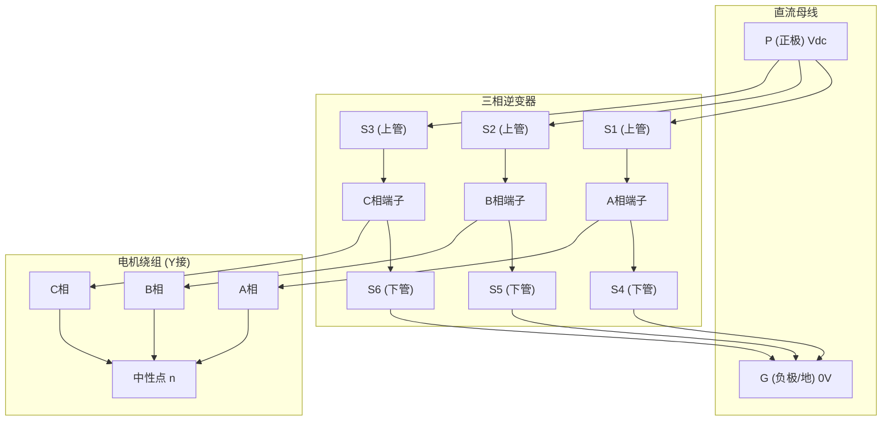
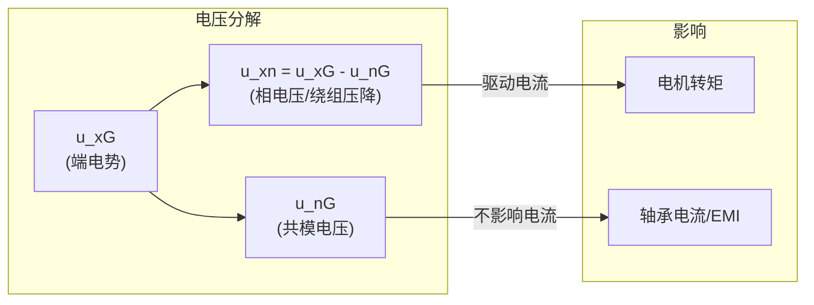
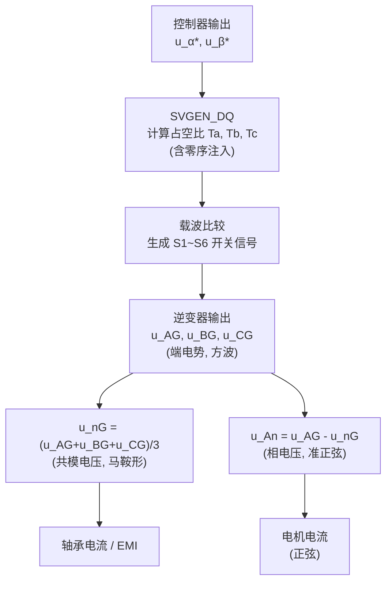

# SVPWM 中的 u_nG 波形分析

## 什么是 u_nG？

**u_nG** 是电机绕组**中性点 n** 对**直流母线负端 G (Ground/负极)** 的电压，也叫做**中性点电位**或**共模电压 (Common-Mode Voltage, CMV)**。

### 电路拓扑中的电压参考点



## 关键电压关系

### 定义各电压符号

| 符号 | 含义 | 代码中对应变量 |
|------|------|---------------|
| **u_AG** | A相端子对G的电位（端电势） | `voltage_potential_at_terminal[0]` |
| **u_BG** | B相端子对G的电位 | `voltage_potential_at_terminal[1]` |
| **u_CG** | C相端子对G的电位 | `voltage_potential_at_terminal[2]` |
| **u_nG** | 中性点对G的电位 | **代码中未直接存储，需计算** |
| **u_An** | A相绕组压降（相电压） | — |
| **u_AB** | 线电压 | `line_to_line_voltage_AB` |

### 端电势 u_xG（x = A, B, C）

每相端电势取决于开关状态：
- **上管 Sx 导通** → `u_xG = Vdc`
- **下管 S(x+3) 导通** → `u_xG = 0`

在代码 [tutorials_ep3_svpwm.py](file:///Users/horyc/codes/acmsimpy/simulation/tutorials_ep3_svpwm.py#L993-L1014) 中：

```python
# 端电势
if svgen1.S1 == True:
    svgen1.voltage_potential_at_terminal[0] = Vdc    # u_AG = Vdc
elif svgen1.S4 == True:
    svgen1.voltage_potential_at_terminal[0] = 0       # u_AG = 0
else:
    # 死区期间，由电流方向决定
    svgen1.voltage_potential_at_terminal[0] = Vdc if ACM.ia < 0 else 0
```

### 从端电势推导 u_nG

对于 Y 接电机，三相绕组对称，绕组压降之和为零：

$$u_{An} + u_{Bn} + u_{Cn} = 0$$

又因为：

$$u_{An} = u_{AG} - u_{nG}$$

所以：

$$(u_{AG} - u_{nG}) + (u_{BG} - u_{nG}) + (u_{CG} - u_{nG}) = 0$$

$$\boxed{u_{nG} = \frac{u_{AG} + u_{BG} + u_{CG}}{3}}$$

> [!IMPORTANT]
> **u_nG 就是三相端电势的平均值**，也等于共模电压。这个量在代码中没有直接保存，但可以从 `voltage_potential_at_terminal[0,1,2]` 计算得出。

## u_nG 的波形形态

### 在不同调制方式下的形态

#### SPWM（正弦脉宽调制）
- u_nG ≈ Vdc/2（恒定）
- 共模电压是常数，因为 SPWM 注入的零序分量为零

#### SVPWM（空间矢量脉宽调制）
- u_nG 呈现**马鞍形（saddle-shaped）** 波形
- 包含显著的**三次谐波分量**（3倍基频）
- 波形在 Vdc/6 到 5Vdc/6 之间波动

### 为什么 SVPWM 的 u_nG 不是常数？

SVPWM 的核心操作是**注入零序电压 Unot**（对应代码中 `v.Unot`），使三相占空比对称下移或上移，从而：

1. 实现更高的母线电压利用率（比 SPWM 高 15.47%，即 $\frac{2}{\sqrt{3}} \approx 1.1547$）
2. 零序分量只出现在中性点电位中，**不影响相间的线电压和电机电流**

在代码的 [SVGEN_DQ 函数](file:///Users/horyc/codes/acmsimpy/simulation/tutorials_ep3_svpwm.py#L624-L702) 中，这体现在每个扇区的占空比计算中：

```python
# Sector 1 为例
v.Tb = (1-t1-t2)*0.5 + Tz*0.5   # 零矢量时间平分 → 这就是零序电压注入
v.Ta = v.Tb + t1
v.Tc = v.Ta + t2
```

`(1-t1-t2)*0.5` 就是将零矢量（V0 和 V7）的时间**平均分配到一个开关周期的两端**，这等价于注入了一个三次谐波零序电压。

## u_nG 波形的物理含义



| 特性 | 说明 |
|------|------|
| **对电机电流无影响** | u_nG 是共模分量，Y接电机中三相对称，共模电压被中性点抵消 |
| **影响轴承电流** | u_nG 的快速跳变（dv/dt）通过寄生电容耦合到轴承，产生轴承电流，加速轴承磨损 |
| **影响 EMI** | u_nG 是高频共模噪声的来源 |
| **反映调制策略** | SVPWM 的马鞍形 u_nG 是其注入零序分量的直观体现 |

## 在 ACMSimPy 中如何观察 u_nG

代码中没有直接记录 u_nG，但你可以通过以下方式计算并绘制：

```python
# 在 watch_data 中，index 30/31/32 存储了端电势（带偏移）
# watch_data[30] = 30 + voltage_potential_at_terminal[0]   (u_AG + 30)
# watch_data[31] = voltage_potential_at_terminal[1]         (u_BG)
# watch_data[32] = -30 + voltage_potential_at_terminal[2]  (u_CG - 30)

# 去除绘图偏移后计算 u_nG:
u_AG = watch_data[30] - 30
u_BG = watch_data[31]
u_CG = watch_data[32] + 30
u_nG = (u_AG + u_BG + u_CG) / 3
```

> [!TIP]
> 你可以修改 `watch_data` 的某个空闲通道（比如 `watch_data[33]`）来直接记录 u_nG，在仿真主循环中添加：
> ```python
> watch_data[33][watch_index] = (svgen1.voltage_potential_at_terminal[0] 
>                              + svgen1.voltage_potential_at_terminal[1] 
>                              + svgen1.voltage_potential_at_terminal[2]) / 3.0
> ```

## 仿真波形

以下是使用 ACMSimPy 仿真生成的实际波形（Vdc=150V, 21极对, 200rpm）：

### 全局视图


从上到下依次为：
1. **端电势** u_AG, u_BG, u_CG — 在 0 和 Vdc 之间跳变的方波
2. **u_nG 共模电压** — 可以观察到其包络在 Vdc/2 附近呈**马鞍形**波动
3. **相电压** u_An = u_AG - u_nG — 减去共模后，呈准正弦 PWM 波形
4. **线电压** u_AB, u_BC — 共模完全消除，三电平方波
5. **占空比** Ta, Tb, Tc — SVPWM 特有的马鞍形调制波

### 局部放大（~40ms 窗口）


### 精确 2 个电周期（~28.6ms 窗口）


2 个电周期的放大图中可以清晰看到：
- **(b)** u_nG 的**马鞍形包络**在 Vdc/6 (25V) 和 5Vdc/6 (125V) 之间变化
- **(d)** 占空比 Ta, Tb, Tc 呈现马鞍形调制波，这是三次谐波注入的直接体现
- **(e)** 线电压中共模 u_nG 被完全消除，仅含差模分量

## 总结



- **u_nG = (u_AG + u_BG + u_CG) / 3**，是三相端电势的数学平均
- 在 SVPWM 下呈**马鞍形**，含三次谐波，频率为基频的 3 倍
- 它**不影响电机相电流和转矩**，但与轴承电流和 EMI 密切相关
- 理解 u_nG 的关键：它是 SVPWM 零序电压注入的直接体现
